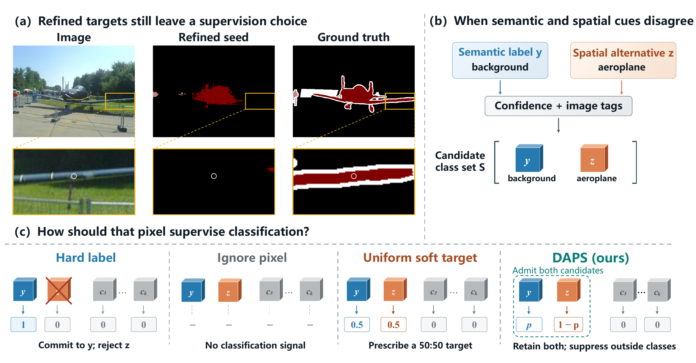
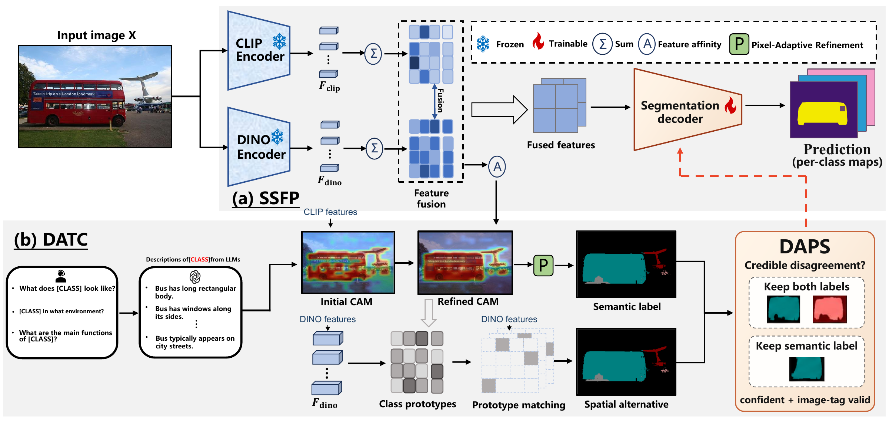

<div align="center">

# When Semantic and Spatial Cues Disagree:<br>Partial Supervision for Weakly Supervised Segmentation

**DAPS · Disagreement-Aware Partial Supervision**

[Paper](docs/DAPS_Manuscript.pdf) · [Overview](#overview) · [Results](#main-results) · [Installation](#requirements) · [Training](#train-daps) · [Evaluation](#evaluate-daps)

</div>

Research code for DAPS, an image-level weakly supervised semantic segmentation framework that retains credible semantic–spatial alternatives instead of forcing every uncertain pixel into a single class.

## Overview

**Motivation.** A refined semantic pseudo label can still miss an object part or confuse a co-occurring region. When a spatial cue proposes a credible alternative, hard supervision suppresses that alternative, ignoring the pixel loses its classification signal, and a uniform target imposes equal probabilities. DAPS retains the admissible labels and penalizes probability assigned to unrelated classes.



**Framework.** DAPS connects two modules:

- **Semantic–Spatial Fusion and Prediction (SSFP)** combines frozen CLIP ViT-B/16 and DINOv2 ViT-B/14 features through trainable projection, fusion, and a segmentation decoder. The fused representation also estimates affinity for target refinement.
- **Disagreement-Aware Target Construction (DATC)** refines CLIP-based responses into a semantic label and pools image-specific DINO prototypes to propose a spatial alternative. A second label is admitted only when it is confident, disagrees with the semantic label, and is compatible with the image tags. Candidate-set classification retains both labels, while Dice and affinity supervision remain active.

Only SSFP is needed for prediction at inference; DATC and image tags are used during training.



## Main Results

Segmentation mIoU (%) reported in the latest manuscript, with DenseCRF:

| Dataset | Frozen encoders | Val | Test |
|:---|:---|---:|---:|
| PASCAL VOC 2012 | CLIP ViT-B/16 + DINOv2 ViT-B/14 | **80.8** | **80.6** |
| MS COCO 2014 | CLIP ViT-B/16 + DINOv2 ViT-B/14 | **51.6** | — |

**CAM seed quality:** 78.60% mIoU on the official VOC train split, using learned affinity + PAR without DenseCRF.

## Data Preparation

### PASCAL VOC 2012

Download and extract the VOC train/validation images:

```bash
wget http://host.robots.ox.ac.uk/pascal/VOC/voc2012/VOCtrainval_11-May-2012.tar
tar -xf VOCtrainval_11-May-2012.tar
```

Place the files as follows:

```text
VOCdevkit/
└── VOC2012/
    ├── Annotations/
    ├── ImageSets/
    │   └── Segmentation/
    ├── JPEGImages/
    ├── SegmentationClass/
    ├── SegmentationClassAug/
    └── SegmentationObject/
```

Training reads RGB images and the image-level labels in `datasets/voc/cls_labels_onehot.npy`. Pixel masks are used for evaluation and visualization. The supplied split lists are in [`research/splits/`](research/splits/); downloading the full dataset does not change the configured training subset.

### MS COCO 2014

The paper reports COCO results. The runnable DAPS entry points below are for VOC.

## Requirements

Run the following commands from the extracted `DAPS/` directory on a Linux machine with an NVIDIA GPU. The archived environment uses Python 3.11, PyTorch 2.9.1, torchvision 0.24.1, and CUDA 12.8 wheels.

```bash
conda create -n daps python=3.11 -y
conda activate daps
python -m pip install torch==2.9.1 torchvision==0.24.1 --index-url https://download.pytorch.org/whl/cu128
python -m pip install "setuptools<81" wheel "numpy==1.26.4" Cython
python -m pip install -r requirements.txt
```

The recorded versions are listed in [`requirements-runtime.txt`](requirements-runtime.txt). DenseCRF is imported as `pydensecrf`, provided by the `pydensecrf2` dependency.

### Pretrained Encoders

Fetch the pinned official DINOv2 architecture and the generic pretrained encoder weights:

```bash
git clone https://github.com/facebookresearch/dinov2 third_party/dinov2
git -C third_party/dinov2 checkout 7764ea0f912e53c92e82eb78a2a1631e92725fc8
mkdir -p pretrained
wget -P pretrained https://openaipublic.azureedge.net/clip/models/5806e77cd80f8b59890b7e101eabd078d9fb84e6937f9e85e4ecb61988df416f/ViT-B-16.pt
wget -P pretrained https://dl.fbaipublicfiles.com/dinov2/dinov2_vitb14/dinov2_vitb14_pretrain.pth
```

The text-attribute embedding bank is already included in `attributes_text/`. Dataset images, generic encoder weights, and trained segmentation checkpoints are not bundled.

### Configure Paths

The default layout places `VOCdevkit/`, `pretrained/`, and `third_party/` under the repository root. To use an existing installation:

```bash
python tools/configure.py \
  --voc-root /data/VOCdevkit/VOC2012 \
  --clip-cache /data/pretrained \
  --dino-repo /data/third_party/dinov2 \
  --dino-weights /data/pretrained/dinov2_vitb14_pretrain.pth
```

This updates resource paths in the packaged JSON configurations. The example paths must be replaced with your local paths.

## Train DAPS

```bash
CUDA_VISIBLE_DEVICES=0 bash train_voc.sh runs/DAPS_01
```

Equivalent Python entry point:

```bash
CUDA_VISIBLE_DEVICES=0 python tools/launch.py train \
  --config research/configs/B1_partial_labels.json \
  --run-dir runs/DAPS_01
```

Training completes all configured updates before validation. It saves the prespecified 90% and 100% checkpoints, evaluates both afterward, and writes the selected model to `best.pt`. Use a **new output directory** for every training or evaluation command. Append `--dry-run` to a `tools/launch.py` command to inspect it without starting GPU work.

### Module and Loss Ablations

| Configuration | Role in the paper |
|:---|:---|
| [`D0_no_dino.json`](research/configs/D0_no_dino.json) | CLIP-only control: remove the DINO branch and fusion |
| [`B0_dinov2_control.json`](research/configs/B0_dinov2_control.json) | SSFP with hard classification |
| [`B1_partial_labels.json`](research/configs/B1_partial_labels.json) | DAPS: SSFP with DATC candidate-set classification |

```bash
CUDA_VISIBLE_DEVICES=0 bash train_voc.sh runs/CLIP_only D0_no_dino
CUDA_VISIBLE_DEVICES=0 bash train_voc.sh runs/Hard_control B0_dinov2_control
```

These controls retain the semantic target path, Dice supervision, and affinity supervision. The CLIP-only configuration is an internal control, not a full ExCEL reproduction. `A1_anchored_graph.json` and `AB1_combined.json` remain available as archived exploratory variants; graph propagation is disabled in the paper's DAPS configuration.

## Evaluate DAPS

### Semantic Segmentation

Use **I0** for a matched comparison between the hard control and DAPS; use **I1** for the archived DAPS inference variant:

```bash
# Common recipe for controlled comparisons
CUDA_VISIBLE_DEVICES=0 bash eval_voc.sh runs/DAPS_01 runs/DAPS_01_I0 I0

# DAPS inference variant
CUDA_VISIBLE_DEVICES=0 bash eval_voc.sh runs/DAPS_01 runs/DAPS_01_I1 I1
```

The evaluator uses all 1,449 official VOC validation images and does not read validation class tags. Each output directory contains `single.json`, `multiscale.json`, `multiscale_crf.json`, the corresponding per-image confusion matrices, and `summary.json`, with checkpoint hashes and inference parameters.

To verify saved score arithmetic and official image coverage, set `--data` to the same VOC root used for the run:

```bash
python -m research.verify_evaluation \
  --evaluation runs/DAPS_01_I1/multiscale_crf.json \
  --data /data/VOCdevkit/VOC2012
```

### CAM Seed Quality

Evaluate the official VOC train split without DenseCRF:

```bash
CUDA_VISIBLE_DEVICES=0 bash eval_cam.sh runs/DAPS_01 runs/DAPS_01_CAM
```

The evaluator records four stages: direct CAM, static affinity + PAR, learned affinity, and learned affinity + PAR. The paper's seed column corresponds to **`affinity_par_seed`** in `summary.json`. Image tags constrain seed generation; this is separate from image-only validation segmentation.

For the matched 703-image seed-stage ablation:

```bash
CUDA_VISIBLE_DEVICES=0 bash eval_cam.sh \
  runs/DAPS_01 runs/DAPS_01_CAM_ablation research/splits/cam_train_703.txt
```

### Visualization

```bash
CUDA_VISIBLE_DEVICES=0 python tools/launch.py visualize \
  --run runs/DAPS_01 --out runs/DAPS_01_visual
python tools/render_visuals.py \
  --input runs/DAPS_01_visual --output runs/DAPS_01_panels
```

This exports aligned image, ground-truth, single-scale prediction, error, and entropy panels for the fixed cases in `research/splits/visual_ids.json`. The paper figures in `assets/` are supplied separately; the visualization command does not regenerate the complete multi-model paper panels.

## Code Structure

```text
DAPS/
├── README.md
├── assets/                    # Latest paper figures: PNG previews and vector PDFs
├── docs/DAPS_Manuscript.pdf    # Latest 13-page manuscript
├── attributes_text/           # Cached semantic descriptions and text embeddings
├── research/
│   ├── model.py               # Frozen encoders, trainable fusion, decoder, affinity
│   ├── methods.py             # Prototype construction and partial-label objective
│   ├── train.py               # Training and post-training checkpoint selection
│   ├── final_evaluate.py      # VOC segmentation and DenseCRF evaluation
│   ├── configs/               # DAPS and control configurations
│   └── splits/                # Fixed training, validation, and seed-evaluation IDs
├── supplementary/             # Seed evaluation, visual export, CLIP-only model
├── tools/                     # Launch, resource configuration, panel rendering
├── results/recorded_metrics.json
├── train_voc.sh
├── eval_voc.sh
└── eval_cam.sh
```

## Citation

Please refer to the [DAPS manuscript](docs/DAPS_Manuscript.pdf) for this method. Author metadata is still left as placeholders in the current draft.

The semantic pipeline builds on [ExCEL (CVPR 2025)](https://github.com/zwyang6/ExCEL). Please also acknowledge the original work when using the inherited implementation:

```bibtex
@inproceedings{yang2025exploring,
  title={Exploring CLIP's Dense Knowledge for Weakly Supervised Semantic Segmentation},
  author={Yang, Zhiwei and Meng, Yucong and Fu, Kexue and Tang, Feilong and Wang, Shuo and Song, Zhijian},
  booktitle={Proceedings of the Computer Vision and Pattern Recognition Conference},
  pages={20223--20232},
  year={2025}
}
```

## Acknowledgement

This implementation builds on [ExCEL](https://github.com/zwyang6/ExCEL), [CLIP](https://github.com/openai/CLIP), [DINOv2](https://github.com/facebookresearch/dinov2), and inherited components from [WeCLIP](https://github.com/zbf1991/WeCLIP). Attribution is recorded in [`THIRD_PARTY.md`](THIRD_PARTY.md). The README  all method descriptions and result summaries here refer to DAPS.

Third-party code and pretrained weights retain their upstream terms. See [`CODE_CHANGES.md`](CODE_CHANGES.md) for source-packaging changes and [`docs/README_UPDATE.json`](docs/README_UPDATE.json) for this documentation update. Training, evaluation, split lists, and recorded numerical results are unchanged.
